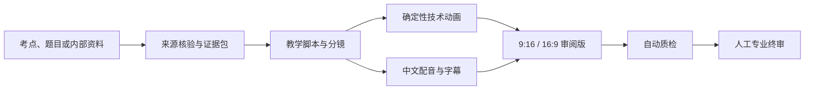
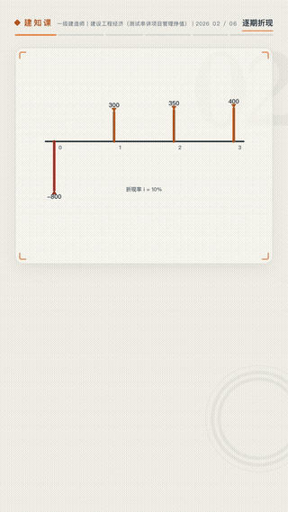
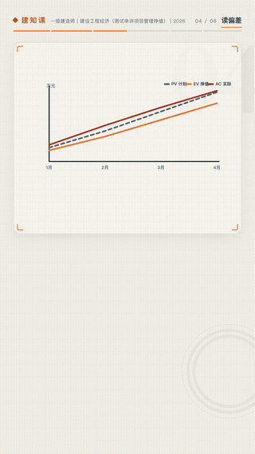

# 建知课 · 建筑考证讲解视频 Skill

[](LICENSE)

把一级建造师、二级建造师和一级造价工程师的考点，转换成有依据、能复算、可审阅的中文讲解视频。

它不是一个“输入标题就直接出片”的黑盒。Skill 会先建立来源与结论的对应关系，再生成脚本、动态技术图示、配音、字幕和横竖双版视频；自动检查完成后仍保留人工专业终审门禁。

## 它解决什么问题

建筑考试内容经常同时包含规范口径、施工顺序、工程量计算和易错判断。普通文生视频流程很容易把公式、节点、尺寸或工序关系画错。本 Skill 将内容拆成两条受控链路：

- **知识链路**：检索权威来源 → 建立证据包 → 编写分镜 → 逐条绑定结论。
- **制作链路**：结构化数据 → HTML/SVG/GSAP 技术图示 → MiniMax 配音 → HyperFrames 横竖双版渲染。



## 当前覆盖范围

| 考试方向 | 状态 | 典型内容 |
|---|---|---|
| 一级建造师 | MVP 支持 | 建筑实务、项目管理、网络计划、施工技术 |
| 二级建造师 | MVP 支持 | 建筑实务、施工管理、法规类考点 |
| 一级造价工程师 | MVP 支持 | 工程计量、造价管理、现金流与工程量计算 |
| 注册建筑师及其他方向 | 暂不纳入 | 后续按考试体系单独扩展 |

默认输出适配视频号、抖音、小红书、B 站和课程平台，包括 1080×1920 竖版与 1920×1080 横版。

## 视频测试用例

下面六组测试来自已完成验证的竖版审阅视频（第二代节拍系统：动画组随旁白推进、同图多场续演不重放、字幕按句切换）。动图为 12 秒无声预览，点击对应链接可下载带配音的示例片段；完整工作流同时支持 9:16 和 16:9。

### 三面投影：体系搭建、一点三投影与展开

**温润男声** · [带配音片段](examples/videos/projection-point.mp4)


### 网络计划：前推、后退与关键线路（四场续演）

**新闻女声** · [带配音片段](examples/videos/network-plan.mp4)


### 放坡基坑：三截面代入与体积计算

**阅历姐姐** · [带配音片段](examples/videos/earthwork-volume.mp4)


### 现金流：时点、逐期折现与 NPV

**甜美女声** · [带配音片段](examples/videos/cashflow-npv.mp4)



### 挣值法：PV/EV/AC 三曲线与 CV/SV 偏差

**甜美女声** · [带配音片段](examples/videos/earned-value.mp4)



### 钢筋下料：逐段绘制、弯折标记与分段累加

**温柔学姐** · [带配音片段](examples/videos/rebar-length.mp4)


这些组件用结构化数据驱动 SVG/HTML 生成，公式和数字可以复算。生成式图片只用于氛围或非关键插图，不承担技术结论。

## 安装

使用 Skills CLI：

```bash
npx skills add anomot/construction-explainer-video-skill \
  -s create-construction-explainer-video
```

全局安装：

```bash
npx skills add anomot/construction-explainer-video-skill \
  -s create-construction-explainer-video -g
```

也可以手动安装：

```bash
git clone https://github.com/anomot/construction-explainer-video-skill.git
cp -R construction-explainer-video-skill/skills/create-construction-explainer-video \
  ~/.codex/skills/
```

## 运行环境

- Python 3.9+
- Node.js 22+
- ffmpeg / ffprobe
- HyperFrames（渲染时由 `npx` 获取）
- MiniMax 官方语音 API：设置 `MINIMAX_API_KEY`（脚本自动向上查找 `.env.local`）
- 可选生图能力：百炼 `qwen-image-3.0-pro`；agent 内置图像工具或 OpenAI `gpt-image-1` 作为备档

复制环境变量模板，不要把真实凭据写进仓库：

```bash
cp .env.example .env.local
```

## 如何使用

安装后直接描述考试方向和知识点：

```text
用 $create-construction-explainer-video 把“一建建筑实务：后浇带施工要求”
做成适合抖音和 B 站的横竖双版讲解视频。
```

只有概念、没有资料也可以启动：

```text
做一期一级造价工程师的现金流量图与净现值讲解，
需要把每期折现过程动态画出来。
```

也可以提供内部教材、讲义或题目用于研究。Skill 会把它们视为受版权约束的输入材料，不会默认整页展示或系统性复刻。

## 标准产物

每个项目使用独立目录保存：

```text
project/
├── project.json                    # 考试、科目、画幅和供应商配置
├── research/
│   ├── sources.json                # 来源清单
│   ├── evidence.json               # 结论与证据映射
│   └── calculation-check.md        # 计算复核
├── content/storyboard.json         # 分镜、旁白、字幕和 claim_ids
├── audio/                          # 分段配音与唯一时间轴
├── composition/
│   ├── vertical/
│   └── landscape/
├── renders/                        # 横竖版 MP4
├── reports/                        # 内容与输出验证报告
└── review/review.json              # 人工终审记录
```

## 质量门禁

正式流程至少经过以下检查：

1. 关键上镜结论必须有来源；来源缺失时停止正式出片。
2. 数字、单位、公式和中间计算必须能够复算。
3. 技术图示使用确定性渲染，生成图不得作为规范或构造依据。
4. 横竖画幅分别排版，不用一次裁切冒充双版适配。
5. 配音时长是字幕和场景时间轴的唯一真源。
6. 自动检查只产生审阅版；人工专业审核通过后才能标记正式版。

## 仓库结构

```text
.
├── README.md
├── LICENSE
├── .env.example
├── previews/                       # README 动画预览
├── examples/videos/                # 12 秒带配音测试片段
└── skills/
    └── create-construction-explainer-video/
        ├── SKILL.md
        ├── agents/openai.yaml
        ├── assets/brand/
        ├── references/
        └── scripts/
```

其中 `SKILL.md` 只保留核心工作流；考试范围、来源政策、画面系统、供应商配置、动态计算案例和质检规则按需从 `references/` 读取。

## 内容与版权边界

- 教材、讲义和题库即使可用于内部分析，也不等于可公开再发布。
- 引用规范和政策时应记录版本、发布日期、检索截止日期和适用范围。
- 本 Skill 用于考试教学内容生产，不替代执业人员判断、施工图设计或现场技术决策。
- 除非文件中另有说明，本仓库内容按 Apache License 2.0 授权。

## 许可证

本项目采用 [Apache License 2.0](LICENSE)。使用、修改和分发时请遵守许可证中的版权、专利、声明保留和变更标注要求。

## 项目状态

当前版本处于 MVP 验证阶段，已经跑通证据包、八类确定性动态图形（网络计划、基坑土方、现金流、构件拆分、流水横道、钢筋下料、挣值三曲线、三面投影）、旁白节拍对位与多场续演动画、MiniMax 多音色配音、按句字幕、双画幅渲染和自动验证。下一阶段将继续补充专业审核后的真实样片、更多工程节点组件和批量生产能力。

欢迎通过 Issue 提交考点案例、计算边界或渲染问题。
